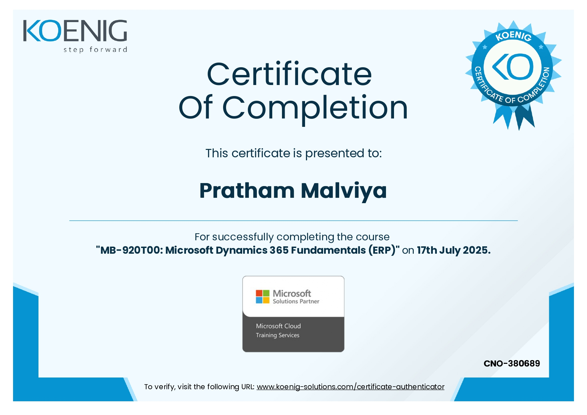
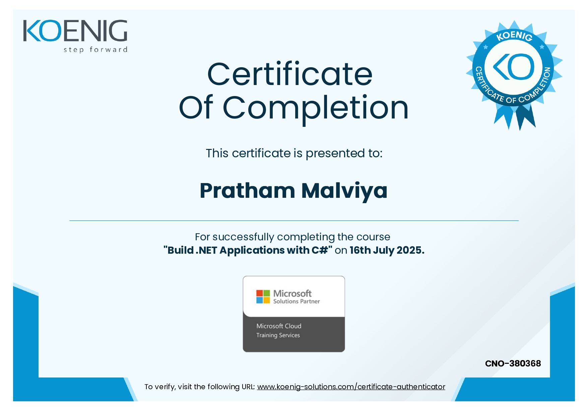

# Koenig Solutions - Microsoft Certification Training

This repository contains my **Microsoft Certification Training** materials and certificates completed during the training program.  

---

## 📄 Certificates (Screenshots)

Here are the certificates I earned during the training program:

  
  
  
  

  <strong>AZ-900:</strong> Azure Fundamentals &nbsp; | &nbsp;
  <strong>PL-900:</strong> Power Platform Fundamentals &nbsp; | &nbsp;
  <strong>MB-920:</strong> Dynamics 365 Fundamentals &nbsp; | &nbsp;
  <strong>.NET with C#:</strong> Practical Training

---

## 📄 Certificates (Original PDFs)

For reference or download, the original PDFs are available here:

- [AZ-900.pdf](original_certificates/AZ-900.pdf)  
- [PL-900.pdf](original_certificates/PL-900.pdf)  
- [MB-920.pdf](original_certificates/MB-920.pdf)  
- [DotNetWithCSharp.pdf](original_certificates/DotNetWithCSharp.pdf)  
- [Microsoft_Certificates_Combined.pdf](original_certificates/Microsoft_Certificates_Combined.pdf)

---

## 🎯 Skills Gained

- **Azure Fundamentals** (AZ-900)  
- **Microsoft 365 & Power Platform**  
- **.NET Development with C#**  
- **Cloud Concepts and Application Development**

---

## 🗂 Repository Structure

koenig-solutions/
├─ certificate_screenshots/ # JPG images of certificates
│ ├─ AZ-900.jpg
│ ├─ PL-900.jpg
│ ├─ MB-920.jpg
│ └─ DotNetWithCSharp.jpg
├─ original_certificates/ # Original PDF certificates
│ ├─ AZ-900.pdf
│ ├─ PL-900.pdf
│ ├─ MB-920.pdf
│ ├─ DotNetWithCSharp.pdf
│ └─ Microsoft_Certificates_Combined.pdf
├─ README.md # This README file
├─ get-pip.py # Python script
└─ merge_pdfs.py # Python script to merge PDFs
